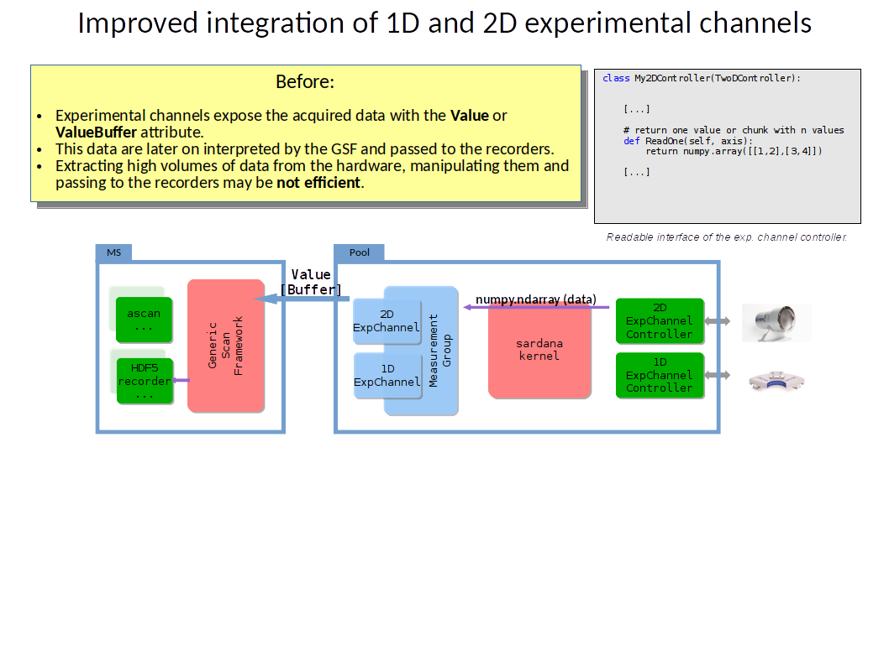
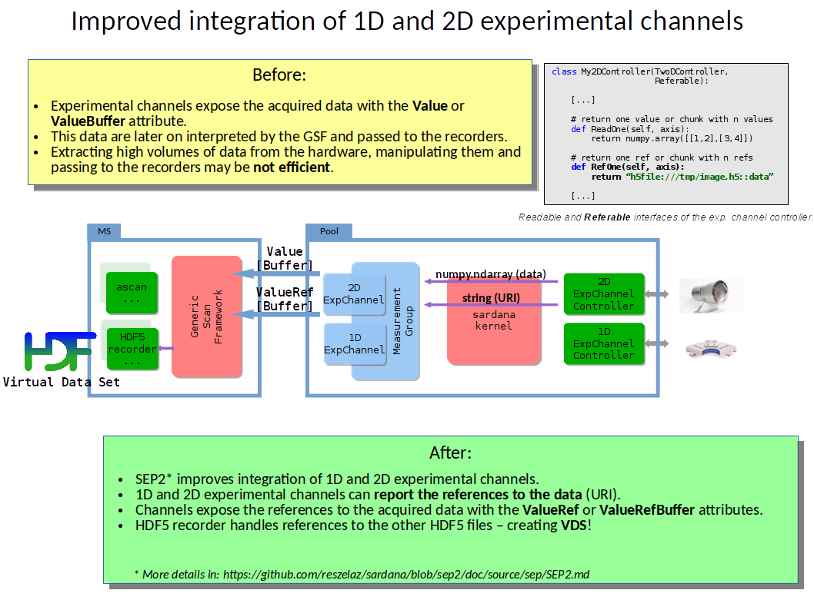
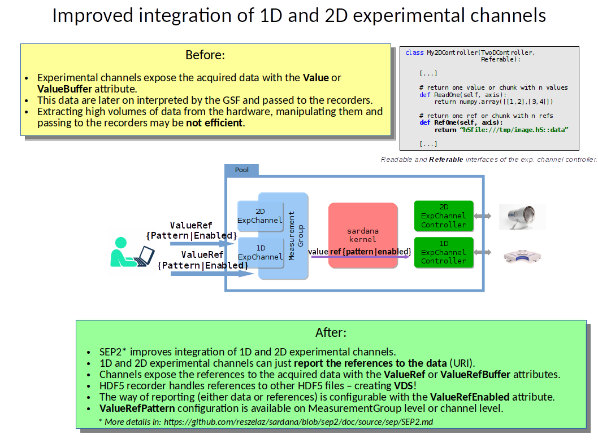

# Practical guide through the SEP2

## Prerequisites

* Sardana server with `sar_demo` environment
* An instance of `BasicDummyTwoDController` and its axis added to the Pool
* An instance of `DummyTwoDController` and its axis added to the Pool
* Virtual Datasets (VDS) feature requires version 1.10 or higher for HDF5 C library,
  and version 2.9 or higher for h5py python library

## Documentation

For the moment there is no written documentation (this may change after this week's Docs Camp). But we have:

* [SEP2 document](https://github.com/reszelaz/sardana/blob/sep2/doc/source/sep/SEP2.md)
* [SEP2 PR](https://github.com/sardana-org/sardana/pull/775)
* [DummyTwoDController](https://github.com/reszelaz/sardana/blob/sep2/src/sardana/pool/poolcontrollers/DummyTwoDController.py)
* [LimaCCDTwoDController](https://github.com/ALBA-Synchrotron/sardana-limaccd)
* this guide:)

## Review scope of SEP2

### Integration of 1D and 2D detectors before SEP2



### Value referencing

* Value reference reporting (value vs. value reference) downstream flow
* VDS when value references point to a dataset of another HDF5 file



### Value referencing configuration

* Value reference configuration (pattern & enable/disable) upstream flow
    * experimental channel level
    * measurement group level



## Single channel acquisition

0. Configure timer for 2d channels:
   ```
   Door> twod01.timer='__self'
   Door> btwod01.timer='__self'
   ```
1. Review interface of a channel with and without referencing capability
   ```
   $> taurusdevicepanel twod01 
   $> taurusdevicepanel btwod01
   ```
2. Acquire to return value:
   ```
   Door> ct 0.1 twod01
   Door> ct 0.1 btwod01
   ```
   Show image from taurusdevicepanel
3. Enable value reference reporting in dummy 2D and acquire:
   ```
   Door> twod01.ValueRefEnabled = True
   Door> ct 0.1 twod01
   ```
   URI points to default location
4. Configure value reference pattern in dummy 2D to return a non HDF5 URI and acquire:
   ```
   Door> twod01.ValueRefPattern = "file:///tmp/foo.edf"
   Door> ct 0.1 twod01
   ```
   URI points to pattern location
5. Configure value reference pattern in dummy 2D to return a HDF5 URI and acquire:  
  ('dataset' name is used by default)
   ```
   Door> twod01.ValueRefPattern = "h5file:///tmp/foo.h5"
   Door> ct 0.1 twod01
   ```
   ```
   $> ls -la /tmp/foo*
   ```
   No such file, as saving is not enabled
6. Configure dummy 2D to save the HDF5 file:  
   ```
   Door> twod01.SavingEnabled = True
   Door> ct 0.1 twod01
   ```
   ```
   $> ls -la /tmp/foo*
   $> silx view /tmp/foo.h5
   ```

## Measurement group acquisition

0. Define measurement group with two channels using expconf:  
   a BasicDummyTwoD channel, and a DummyTwoD channel 
   ```
   btwod01
   twod01
   ```
1. Acquire to return values:
   ```
   Door> ct
   ```
2. Enable Reference from expconf  
   Set 'Ref Enabled' to True for twod01 and acquire (default reference is used):
   **IMPORTANT**: expconf allows to set referencing configuration for channels which do not support that!
   ```
   Door> ct
   ```
   ```
   $> ls -la /tmp/dummy*
   ```
3. For twod01: From expconf set 'Ref Pattern' to ```h5file:///tmp/foo.h5::bar``` and acquire:
   ```
   Door> ct
   ```
   ```
   $> ls -la /tmp/foo.h5
   ```

## Scans: Virtual Datasets (VDS) in SEP2

Virtual Datasets (VDS) feature requires version 1.10 or higher for HDF5 C library, and version 2.9 or higher for h5py python library.


In SEP2, when value references point to a dataset of another HDF5 file, Sardana uses VDS if available.
In this case, each single 2D dataset will be stored in a different h5 file, and the VDS feature will be used to access all datasets from a single (master) h5 file.


0. Create folder to store data:
   ```
   $> mkdir -p /tmp/vds
   ```

1. Set a ScanDir and a ScanFile
   ```
   Door> senv ScanDir /tmp/vds/
   Door> senv ScanFile vds.h5  
   ```

2. From expconf: 
   - Create/choose a measurement group containing a 2D channel
   - Set a Ref Pattern which contains {index} placeholder:
   ```h5file:///tmp/vds/foo_{index}.h5```

3. Perform the scan:
   ```
   ascan mot01 0 2 3 0.5
   ```
4. The resulting files are stored in /tmp/vds. The file 'vds.h5' contains the virtual dataset.
   ```
   $> ls -la /tmp/vds  
   $> silx view /tmp/vds/vds.h5
   ```

Source h5 files and main VDS h5 files are stored.
If the references could not be correctly resolved at VDS file creation time or some other error occurred, the main file would still contain the references to the source files as strings, instead of allowing the data visualization.

Note: Value referencing works with step and continuous scans and any type of synchronization.

## What else could be done and was out of SEP2 scope

* Reporting of multiple frames in one URI (slicing) `h5file:///tmp/foo::bar[0:10]`
* Abstraction of external image processing (ROI, binning, etc)
* Controller (plugin) could report dtype and shape, now it reports it on initializtion (dtype and max shape) 
